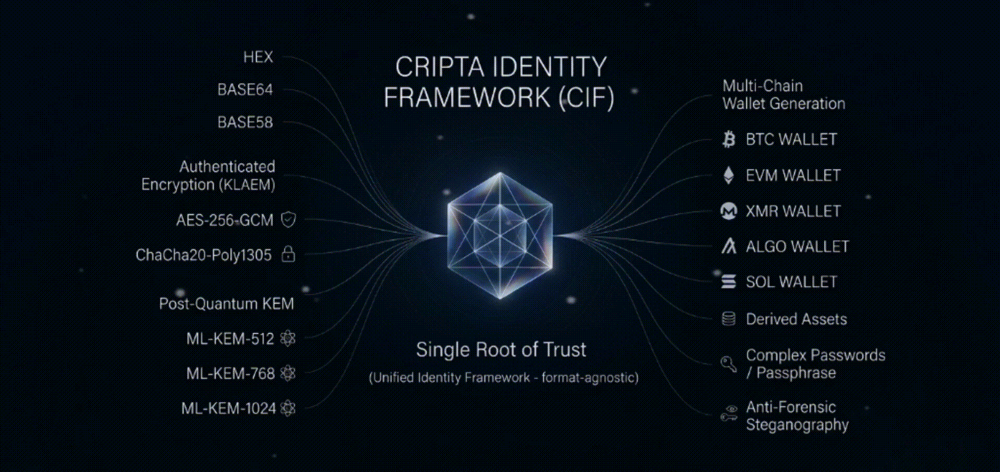
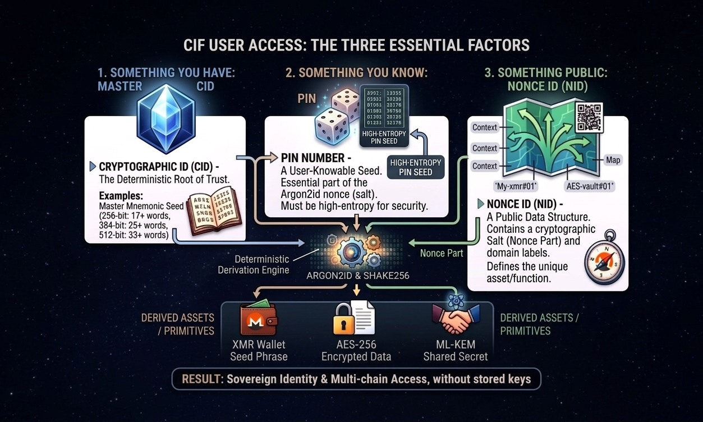
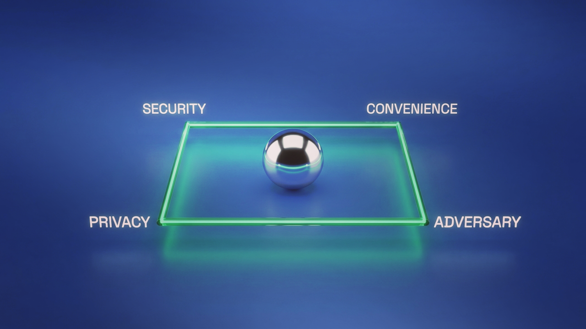
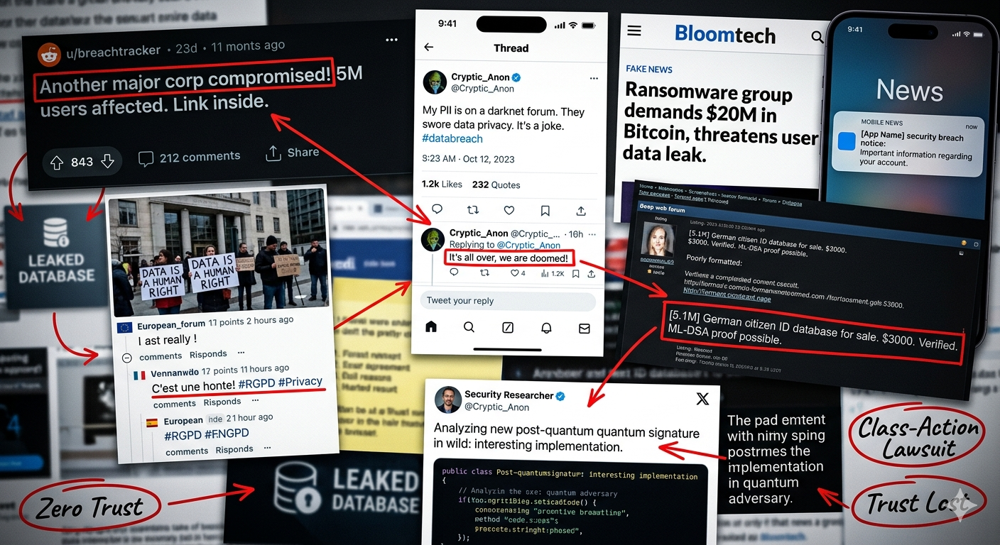

<div align="center">


# Cripta Identity Framework (CIF)

[](https://csrc.nist.gov/pubs/fips/203/final)
[](#-why-choose-cif)
[](#-current-status--collaboration)

[](https://nodejs.org)
[](https://www.npmjs.com/package/@stless/cif)
[](https://www.npmjs.com/package/@stless/cif)

[](https://github.com/harnuma9/cripta-identity-framework/stargazers)
[](https://github.com/harnuma9/cripta-identity-framework/fork)
[](https://github.com/harnuma9/cripta-identity-framework/issues)

[](https://github.com/harnuma9/cripta-identity-framework/actions)

<br />

<p align="center">
<strong>A high-integrity identity and cryptographic framework providing deterministic secret derivation, anti-forensic steganography, and post-quantum (ML-KEM) key encapsulation for a “Shared Root of Trust”.</strong>
</p>
</div>

<br />

Instead of managing multiple apps or writing down passwords in paper and then someone would probably find that out and peek a little 👀, you generate everything you need in just one tap. (Apologies... we don’t have an app yet 😓)

<br />

CIF extends beyond stateless generator to provide KeyLess Authenticated Encryption Mode (KLAEM) and **multi-chain wallet generation**.

Possibly, the first ever **“Unified Identity Framework”** that is format-agnostic, enabling deterministic derivation of any cryptographic primitive from a single entropy source.

<br />

> “Life has never been this chaotic... oh my bad. Just thinking about why AI thinks a 'Unified Identity Framework' must be a GIANT DATABASE, or that it doesn't exist yet... our framework proves them wrong.”

<br />
<br />

---

## 📖 Table of Contents
* [Why Choose This?](#-why-choose-cif)
* [What It Can Derive?](#-the-derivation-engine)
* [Simple Logic](#-the-simple-logic-how-it-works)
* **[Installation](#installation)**
* **[Quick Usage](#usage)**
* [Potential Future Widespread Adoption](#potential-future-widespread-adoption)
* [System Architecture](#-deep-dive-system-architecture)
* [Social Impact & Vision](#-is-it-dangerous)
* [Donation](#-support-the-future-of-security)

<br />
<br />

---

## ❓ Why Choose CIF?

<br />

| Feature | Legacy Vaults | Cripta Identity Framework (CIF) |
| :--- | :--- | :--- |
| **Storage** | Encrypted blobs (The "Honey Pot") | **Zero Storage** (Stateless) |
| **Attack Surface** | Brute-forceable if vault is stolen | **Nothing to steal**, Nonce IDs are useless |
| **Future Proof** | Pre-Quantum (Vulnerable) | **Post-Quantum** (ML-KEM/Kyber) |
| **Human Error** | Forget master password = Lost data | **Deterministic Recovery** via Master ID |

<br />

* **No More “Honey Pots”:** By eliminating stored vaults, you remove the target.
* **Quantum-Proof Today:** Native **FIPS 203** standards secure your identity against future threats.
* **Trauma-Informed Design:** Designed for real-life stress. If you can remember a simple PIN and have your Master ID, your digital life is safe.

<br />
<br />

## ✨ The Derivation Engine

### **Raw & Encoded Data**
   

### **Human-Readable Secrets**
   

### **Sovereign Assets (Web3)**
            

### **Privacy Communication**


<br />
<br />

---

## 🚀 Key Features

* **Deterministic Derivation:** Derive BTC, ETH, XMR, and 10+ other chains from one CID.
* **Authenticated Encryption:** KeyLess Mode (KLAEM) using **AES-256-GCM** and **ChaCha20-Poly1305**.
* **Post-Quantum Security:** Shared Root of Trust established via **ML-KEM-512**, **ML-KEM-768**, and **ML-KEM-1024**.
* **Optimization:** Supports **CIF-lite**, a tactical profile designed for resource-constrained environments.

<br />
<br />

---

## 📊 RESOURCE ALLOCATION MATRIX

<br />

### STANDARD & SOVEREIGN TIERS
*(Full Mode: t=3, p=4)*

| CID Type (Bits) | m (KiB) | m (MiB) | Total Bytes | Security Profile |
| :--- | :--- | :--- | :--- | :--- |
| **256** (17 words) | 65,536 | 64 | 32,768 | Standard Sovereign |
| **384** (25 words) | 98,304 | 96 | 49,152 | High-Value Cold |
| **512** (33 words) | 131,072 | 128 | 65,536 | Institutional/Paranoid |
| **obfuscateCID** | 262,144 | 256 | 131,072 | The "Heavy" Shield |

<br />

### TACTICAL & MOBILE TIER
*(Lite Mode: t=2, p=1)*

| CID Type (Bits) | m (KiB) | m (MiB) | Total Bytes | Security Profile |
| :--- | :--- | :--- | :--- | :--- |
| **Lite** (256-bit) | 32,768 | 32 | 4,096 | Tactical/Mobile |

> **Note on Formulas:**
> * **Memory (KiB):** (Bytes * 2) * 1024
> * **Tag Length:** Memory * 0.5

<br />
<br />

## Installation

```bash
npm install @stless/cif
```

<br />

## Usage

### 1. The Foundation: Identity & Derivation

Generate a unique **Cryptographic ID (CID)** and derive deterministic secrets using a **Nonce ID (NID)** and your **PIN**.

```javascript
const Cripta = require('@stless/cif');

// Enable AirGap Mode (Stateless, no-network profile)
await Cripta.toggleAirGap(true);

// Generate a 256-bit Identity (Mnemonic + TV Code)
const { tvCode, mnemonic: cid } = await Cripta.generateCID(256);

// Create a Nonce ID (The 'Map' to your specific secret/wallet)
const nid = await Cripta.generateNID('My-xmr-wallet#01', 'X', 32);

// Recover the deterministic secret (e.g., 25-word Monero seed)
const secretXmr = await Cripta.recoverPass(cid, nid, '837492057164');

// Optional bait PIN that derives decoy wallet seed with small funds
const decoyXmr = await Cripta.recoverPass(cid, nid, '2026');
```

<br />

### 2. KLAEM Mode (KeyLess Authenticated Encryption)

Perform encryption without storing traditional keys. Use `obscureMode` to encrypt the nonces and authentication tags themselves.

### Message Mode (Buffer/String)

Ideal for small data, short notes, or cryptographic fragments.

```javascript
const message = "> Sensitive Data";

// AES-256-GCM
const aesCipher = await Cripta.aesEncrypt(cid, nid1, pin, { data: message });
const aesPlain  = await Cripta.aesDecrypt(cid, nid1, pin, { data: aesCipher });

// ChaCha20-Poly1305 with Stealth Obfuscation
const chaCipher = await Cripta.chachaEncrypt(cid, nid2, pin, { 
  data: message, 
  obscureMode: true // Stealth metadata
});
const chaPlain  = await Cripta.chachaDecrypt(cid, nid2, pin, { 
  data: chaCipher, 
  obscureMode: true 
});
```

### Stream Mode (Large Files)

Process GB-scale files efficiently using Node.js streams. Source and destination paths are handled automatically.

```javascript
const options = { 
  inputPath: './secret.iso', 
  outputPath: './secret.cif', 
  obscureMode: true 
};

// AES-256-GCM Streaming
await Cripta.aesStreamEncrypt(cid, nid1, pin, options);
await Cripta.aesStreamDecrypt(cid, nid1, pin, { ...options, inputPath: './secret.cif', outputPath: './recovered.iso' });

// ChaCha20-Poly1305 Streaming
await Cripta.chachaStreamEncrypt(cid, nid2, pin, options);
await Cripta.chachaStreamDecrypt(cid, nid2, pin, { ...options, inputPath: './secret.cif', outputPath: './recovered.iso' });
```

<br />

### 3. Post-Quantum Handshake (ML-KEM)

Native support for **NIST FIPS 203 (Kyber)** for P2P key encapsulation.

```javascript
// Generate Kyber-768 Keypair
const bobKeys = await Cripta.kyber.generate(768);

// Alice Encapsulates CID for Bob (Format-agnostic)
const aliceEncapped = await Cripta.encapsulateCID(768, bobKeys.pub.hex, true);

// Bob Decapsulates to reach the Shared Root of Trust
const bobDecapped = await Cripta.decapsulateCID(768, bobKeys.priv.base64, aliceEncapped.ciphertext.base58);
```

<br />

### 4. Identity Obfuscation (The Mental Key)

Scramble your Master CID into a 9-word mnemonic plus two fragments. This requires a 128-bit "Mental Key" and an optional salt to derive.

```javascript
// Generate an 8-word Mental Key (128-bit)
const mentalKey = await Cripta.generateMentalKey();

// [OPTIONAL] A unique, long passphrase (salt) to prevent rainbow table attacks.
// This should be a lowercased sentence or string known only to you.
const saltObf = 'your-secret-personal-passphrase-here';

// (For Physical Storage)
// Obfuscate CID: Returns 9-word mnemonic + two scrambled fragments
const { mnemonic9, scrambled1, scrambled2 } = await Cripta.obfuscateCID(cid, mentalKey, saltObf);

// Recovery: Reconstruct the original CID
const recovered = await Cripta.deobfuscateCID(mnemonic9, scrambled1, scrambled2, saltObf);

// (For Cloud Storage)
// Scramble real CID among 20 decoys
const { mnemonic9: vaultMn, splitCIDs } = await Cripta.vaultMixCIDs(cid, mentalKey, 20);

// Unscramble to recover the legitimate Identity
const realIdentity = await Cripta.vaultUnmixCIDs(vaultMn, splitCIDs);
```

<br />

### 5. Format Interoperability & QR Delivery

Seamlessly switch between TV-Codes and Mnemonics, or export Nonce IDs for physical air-gap scanning.

```javascript
// Format Recovery: Returns full format regardless of TV-Code and Mnemonic formats
const fromTV = await Cripta.recoverOtherCID(tvCode);
const fromMn = await Cripta.recoverOtherCID(cid);

// Physical Handover: Render a Nonce ID as a terminal-ready QR Code
const terminalQR = await Cripta.generateNidQR(nid, { format: 'terminal' });
console.log(terminalQR);
```

<br />

> [!CAUTION]
> 
> Chances of **high implementation risk** when using private functions due to internal buffer-zeroing.
> Ensure any reused input buffers are passed through `Buffer.from()`.

<br />
<br />
<br />

---

## 🧠 The Simple Logic: How it Works

<br />

<div align="center">
  
</div>

<br />

### The MCUID Protocol: 3-Factor Access Model

The **Multi-Chain Unified ID (MCUID)** replaces "storing keys" with **"calculating keys"** on the fly.
Access is predicated on three distinct factors that combine to mathematically derive your secret:

1. **Something You Have:** The Master Cryptographic ID (**CID**). This is your **MCUID Root DNA** — the absolute source of your deterministic identity.
2. **Something You Know:** A **PIN** number (Argon2id salt, supporting up to 16 digits).
3. **Something Public:** The Nonce ID (**NID**). The "Map" or "Label" to your specific secret (e.g., `john.doe123@email.com`, `my-btc-wallet#01` or `session-messenger-id`).

> **The Result:** One Identity (CID) can generate 1,000 different wallets and passwords. You don't save a "vault" file; you simply maintain your NIDs.

<br />
<br />

---

<br />

<div align="center">
  
</div>

<br />

### The Stable Quad (Plausible Deniability)
Traditional systems force a trade-off between Security, Convenience, and Privacy. CIF introduces **The Adversary**.

* **The Bait Protocol:** Surrender a CID, NID, and a specific **“Bait PIN”** to reveal a decoy environment.
* **The Reality:** Your true identity and primary assets remain mathematically hidden behind your real PIN.

<br />
<br />

---

## 🛡️ Deep-Dive: System Architecture

<br />

### 🔑 Keyless Authenticated Encryption (KLAEM)
The framework enables encryption without traditional keys. By using `obscureMode`, both the nonce and the authenticated tag remain encrypted, hardening data against forensic analysis and metadata leaks.

<br />

### 🧬 Shared Root of Trust (Post-Quantum)
Beyond simple messaging, CIF uses **ML-KEM (Kyber)** to establish a collaborative identity. Once Alice and Bob perform a post-quantum handshake, they synchronize a **Shared Root of Trust**. 

<br />

* **Beyond Telecoms:** This isn't just for chat. It allows two parties to derive the *same* deterministic primitives (Wallets, Passwords, Encodings) from a single shared state.
* **NID Exchange:** Partners can generate and share **Nonce IDs (NIDs)** to access collaborative assets (e.g., a shared Multi-sig seed or an encrypted volume) without ever transmitting the underlying keys.

<br />

### 🛡️ Reduced Attack Surface
By removing the “cluttered vault” model, CIF neutralizes common attack vectors like credential stuffing and local vault extraction. Since the framework is stateless and deterministic:
* **No encrypted keys to steal = Nothing to brute-force.**
* **Zero-Knowledge:** The framework never "sees" your entropy; it only calculates the result and forgets.

<br />
<br />

---

<br />

<div align="center">
  
  <br />
  <br />
  <em>
    The modern reality of data liability: Every stored record is a future headline.
    <sub>(AI-generated photo)</sub>
  </em>
</div>

<br />

## Mitigation of Corporate Data Breaches

In the modern threat landscape, storing user data is a massive liability. A single ransomware event can lead to bankruptcy, class-action lawsuits, and total loss of trust.

<br />

> [!NOTE]
> **“No matter where you live or what language you speak, if you rely on a corporation to hold your ‘keys’, you are equally vulnerable.”**

<br />

Under laws like **GDPR** or **CCPA**, if you don’t maintain a database of personal information, you may not be required to report a breach.

This framework enables organizations to interact with users without necessarily storing their personal data aside from necessary metadata — in accordance to the established policies and terms of services.
This shift reduces infrastructure complexity and mitigates some of the systemic risks posed by both data breaches and emerging quantum adversaries.

<br />
<br />

---

<br />

<div align="center">
  
</div>

<br />

## Potential Future Widespread Adoption

The **ease of implementation** at the architectural level makes this framework the logical “drop-in” replacement for the brittle, legacy Identity-as-a-Service (IDaaS) models currently governing global data. As we cross the **2026 Quantum Threshold**, the industry's reliance on static, stored keys might become a systemic, catastrophic risk to the very foundations of digital trust.

Upcoming **digital ID mandates** and aggressive **age verification checks** imposed by global policymakers are potentially creating the largest centralized honey pots in human history. By forcing users to upload government-issued credentials to vulnerable third-party silos, these policies are essentially pre-signing the headlines for the next decade of state-level data breaches.

<br />

> There are only eight months remaining in 2026, and we are already seeing chaos and a loss of common sense among policymakers who — in the name of the bills they pass — are putting the public at even greater risk.
> 
> When a politician says, ‘We need more data for safety,’ the reality seems to be: **‘We need more data to leak to the adversary.’**

<br />

Although not every third-party services or IDaaS are same, uncertainty and fear still remain. **People don't know who to trust with their data.**

Let’s bring back the common sense and online safety without the data mining. Massive data collection only invites malicious actors and identity theft. Once privacy is breached, the damage is done — there is no ‘delete’ key for leaked personal information.

By adopting this identity framework, organizations can satisfy regulatory “Proof-of-Age” or “Proof-of-Identity” requirements without ever touching — or being liable for — the user’s underlying PII.
CIF turns the current “IDaaS” model on its head: instead of asking the user for their data, the organization provides a NID (Nonce ID) and asks the user to provide a  Post-Quantum Signature.

Alternatively, implementing **Post-Quantum Key Exchange** allows organizations to establish secure, **permission-based shared root of trust** that prevent the ‘Adversary’ from intercepting or decrypting sensitive handshake data. 
This framework secures every point of entry: **whether it's providing a basic access to services, verifying an email, launching an account, or initializing a crypto wallet with KYC checks.**

<br />

**No data leaks = No liability to report.**

<br />
<br />

---

## 🤝 Current Status & Collaboration

CIF is currently a labor of love and a coping mechanism for the challenges I’ve faced.

**Audit Status:** As an independent developer, I lack the funds for a formal external security audit. This is currently an experimental stable version.

**The Goal:** To transform this framework into a production-ready, accessible app that protects users who, like me, need to be able to “forget” their security to stay safe.

<br />
<br />

---

## 🤔 Is it dangerous?

<br />

<p align="center">
  <b>It depends on the hand that holds it.</b>
</p>

<br />

This framework was born **from a place of necessity following physical trauma**. In the aftermath of an assault, the “small” things such as forgetting a password, losing a key, or being locked out of your own digital life — don't just feel like inconveniences. **They feel like a second assault.** They are reminders of a lack of control, leading to a deep, agonizing frustration with one’s own perceived inefficiency.

The reality of trauma is that you may never feel “normal” again until you finally feel **safe**. But in those moments of high stress or hyper-vigilance, can you truly rely on your memory? Can you even remember your seed phrase when your body is under survival mode?

<br />

### The Hammer Analogy
Ultimately, this is a tool. Just like a hammer:
* In **construction**, it is a legal and essential instrument for building.
* In **violence**, it is a weapon used to cause harm.

<br />

The tool itself is neutral; the intent defines the outcome. This framework was built to provide a sense of security and efficiency for those who need it most. Use it to build, not to break.

<br />

---

## Our Vision

We are aiming for privacy-focused app, as well as following as close as possible to the natural ways humans seek the path of least resistance, or as they called it “convenience”, “laziness”, or “efficiency”, but this same drive is **exactly why security becomes a nightmare**.

In an unforeseeable crisis, any security system requiring perfection is a potential **failure** waiting to happen. You’ll forget a character, lose a key, or panic and surrender your password, locking you out of your identity and your hard-earned savings or investment wallet. **No amount of technicality can sustain a human operative reduced to the raw logic of survival.**

<br />

> [!TIP]
> ### “With your help, we can develop a more accessible app with convenience without compromise, for a much easier use and less prone to human errors, which would be incredibly helpful for the privacy of users across the internet!”

<br />

**Motto:** *“Use then forget. And then? And then they find nothing.”*

<br />

## Want to contribute or give some feedback? Found a bug or have a feature request?

Please search for any [existing issues](https://github.com/harnuma9/cripta-identity-framework/issues) that describe your bugs in order to avoid duplicate submissions.

<br />

> [!IMPORTANT]
> 
> To reduce the risk of **[supply-chain attacks](https://www.crowdstrike.com/en-us/cybersecurity-101/cyberattacks/supply-chain-attack/)**, future updates and bug fixes may take longer — critical security fixes will be prioritized and released faster.
> 
> See: **[SECURITY.md](./SECURITY.md)**

<br />
<br />

## 💚 Support the Future of Security

CIF is an independent effort. If this framework provides you with a sense of security or helps mitigate your professional liability, consider supporting its continued development.

<br />

<div align="center">

| Monero (XMR) | Bitcoin (BTC) | Zcash (ZEC) | USDC (SOL) |
| :---: | :---: | :---: | :---: |
|  |  |  |  |
| [](monero:4A2hj1kK5nXUzmVEBVZyEb2Y3oL4KLBG39zREcjXYZh5Ji8hia2na6xF7836tw1zdGUnKr3ZMDYt68NU1ydVpHhrT9AEywB) | [](bitcoin:bc1q5304udm5pwgemd70wgklqk8nm44lxkkguzd65v) | [](zcash:t1LbQShCfcdXMCkN1AkzwvF15P98s8xjtcV) |[](solana:GW6csdpnkb7v5DiFkiVRS2edEQWfsd1oxhyPztdzgaip) |


<details>
<summary><b>Click to show raw addresses</b></summary>

**XMR:** `4A2hj1kK5nXUzmVEBVZyEb2Y3oL4KLBG39zREcjXYZh5Ji8hia2na6xF7836tw1zdGUnKr3ZMDYt68NU1ydVpHhrT9AEywB`

**BTC:** `bc1q5304udm5pwgemd70wgklqk8nm44lxkkguzd65v`

**ZEC:** `t1LbQShCfcdXMCkN1AkzwvF15P98s8xjtcV`

**USDC SOL:** `GW6csdpnkb7v5DiFkiVRS2edEQWfsd1oxhyPztdzgaip`

</details>

</div>

<br />

> [!IMPORTANT]
> **Note on Privacy:** Donations are non-reciprocal gifts. Due to the **Zero-Knowledge architecture** of CIF, the author has no access to user entropy, and donors gain no access to the author’s private implementation or Master CIDs.

<br />
<br />

---

### 🛡️ Integrity & Verification
The core engine is signed using **[NIST FIPS 204 (ML-DSA)](https://csrc.nist.gov/pubs/fips/204/final)**.

* **Public Key:** [`security/mldsa87_pub.pem`](security/mldsa87_pub.pem)
* **Signature:** [`security/cif.js.sig`](security/cif.js.sig)

*For verifying signature using a legacy one for compatibility reasons, nahh.*

<br />

**Verify via OpenSSL:**

```bash
openssl pkeyutl -verify -pubin -inkey security/mldsa87_pub.pem -sigfile security/cif.js.sig -in lib/cif.js
```

<br />

> [!NOTE]
> 
> This work is the original work of Aries Harbinger. Possession of the 
> cryptographic keys corresponding to the signatures within this repository 
> constitutes proof of authorship. 
> 
> Licensed under **[BUSL-1.1](https://spdx.org/licenses/BUSL-1.1.html)** until **2030-03-21** 
> after which it converts to **Apache License 2.0**.
> 
> See: **[LICENSE](./LICENSE)**

<br />
<br />

---

<br />

### 📜 Credits
* **Wordlist:** 2<sup>16</sup> density English corpus derived from [SIL International](http://www-01.sil.org/linguistics/wordlists/english/) and curated by the **Yahoo End-to-End** security team.

<br />
<br />
<br />
<br />
